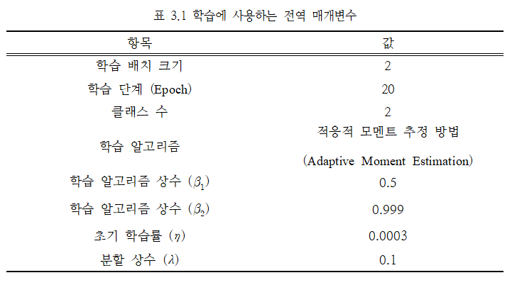

## 윤희승 공학 석사 논문

Link: [적대적 생성 신경망 기반의 영상 분할 기법을 이용한 망막 혈관 분할 방법][Masterpaperlink]

[Masterpaperlink]: https://sites.google.com/view/yoonheeseung-masterpaper

### 1. 기술 스택 및 개발 환경
* Python
* Keras - Python으로 작성된 오픈 소스 신경망 라이브러리
* Tensorflow - Backend 환경에서 구동
* CUDA v9.0 (cuDNN v7.0)
* Numpy - Python 수치 해석 라이브러리
* Matplotlib - Numpy 라이브러리를 활용한 플로팅 라이브러리
* Scikit-learn - 기계 학습 라이브러리(Python용)
* Scipy - 과학 컴퓨팅과 기술 컴퓨팅에 사용
* PIL(Pillow) - Python 이미지 프로세싱 라이브러리


[Requirements](./codes/requirements.txt)

---

+ 실행 환경 : Windows 10
+ IDE : IntelliJ PyCharm
+ CPU : Intel i7-6700K 4.00GHz
+ RAM : 32GB
+ 그래픽카드 : GTX-1080 (RAM 8GB)

### 2. Dataset

<details>
<summary> DRIVE(Digital Retinal Images for Vessel Extraction) & STARE(Structured Analysis of the Retina)
</summary>
  
DRIVE image size : 584x565


STARE image size : 605x700


</details>

### 3. 실행 방법
<details>
<summary>3.1. 데이터 학습
  
  [train.py](./codes/train.py) 실행 </summary>  
  
* 학습 매개변수 설정
  


```python
# training settings
os.environ['CUDA_VISIBLE_DEVICES']=FLAGS.gpu_index
n_rounds=20
batch_size=FLAGS.batch_size
n_filters_d=32
n_filters_g=32
val_ratio=0.1
init_lr=3e-4
schedules={'lr_decay':{},  # learning rate and step have the same decay schedule (not necessarily the values)
           'step_decay':{}}
alpha_recip=1./FLAGS.ratio_gan2seg if FLAGS.ratio_gan2seg>0 else 0
rounds_for_evaluation=range(n_rounds)
```

* 모델 : [model.py](./codes/model.py)

---

</details>

3.2. 데이터 추론
  
  [inference.py](./codes/inference.py) 실행 

3.3. 모델 성능 평가 
  
  [evaluation.py](./codes/evaluation.py) 실행 

  * 성능 평가 척도 : Dice coefficient
  
  * ROC 그래프 AUC(Area Under the Curve) : Specificity, Sensitivity
  
  * PR 그래프 AUC : Precision, Recall(=Sensitivity)

### 4. 저작권 및 라이선스
* MIT
* BSD
* Matplotlib 라이선스

---
Contact : <iyhs1858@gmail.com> 
